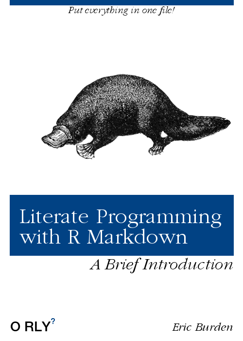

# Presenting... {-}

```{r cover-img, echo=FALSE, out.width = '80%', fig.align = 'center'}
img_path <- rprojroot::is_rstudio_project$find_file('cover.png')

```


In this presentation, we will be discussing literate programming, what it is, and how R and R Markdown provide developers with tools to take advantage of this approach.